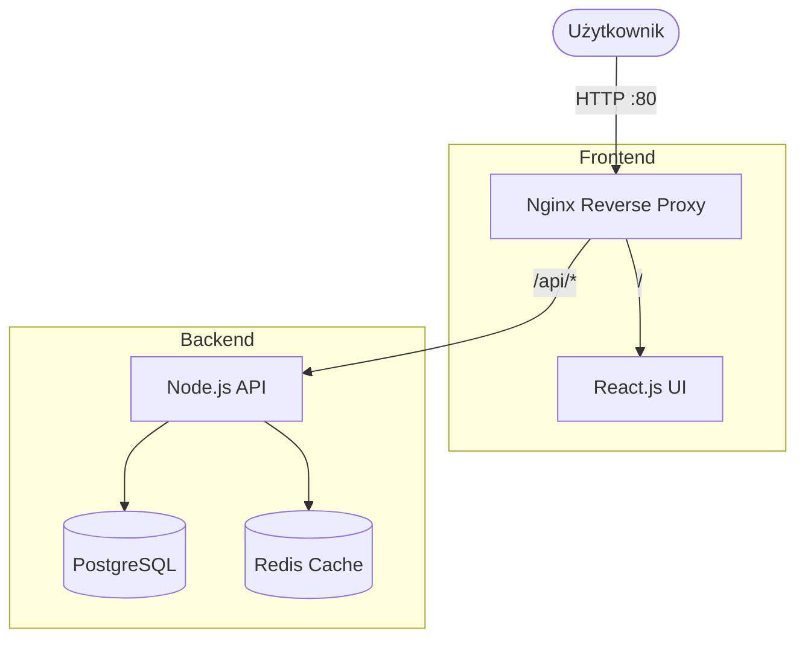

# Projekt Docker — aplikacja wieloserwisowa w Docker Compose

## 1. Architektura i opis usług

Aplikacja to system typu "kalendarz wydarzeń". Frontend serwuje chronologiczną listę bloczków, a backend zapisuje je w bazie danych. Ruch kontrolowany jest przez reverse proxy.



### Lista usług i wystawionych portów
| Usługa | Technologia | Dostęp | Cel |
|--------|-------------|--------|-----|
| **nginx-proxy** | Nginx | `localhost:80` | Reverse Proxy kierujący ruchem |
| **frontend** | React + Nginx | (tylko wewnątrz `frontend_net`) | Serwuje interfejs użytkownika |
| **backend** | Node.js + Express | (tylko wewnątrz `frontend_net` / `backend_net`) | API dla frontendu |
| **postgres-db** | PostgreSQL 16 | (tylko wewnątrz `backend_net`) | Trwała baza danych |
| **redis-cache** | Redis 7 | (tylko wewnątrz `backend_net`) | Cache dla szybszych zapytań API |
| **pgadmin** | pgAdmin 4 | `localhost:5050` (tylko profil `debug`) | Interfejs do przeglądania bazy |

## 2. Instrukcja uruchomienia od zera

1. Sklonuj repozytorium i wejdź do głównego katalogu aplikacji.
2. Upewnij się, że masz przygotowany plik ukrywający sekrety w folderze bazowym (np. wykonując na wzór `.env.example` polecenie `cp .env.example .env`).
3. Podnieś główne środowisko wraz z budową obrazów z Dockerfiles:
   ```bash
   docker compose up -d --build
   ```
4. Aplikacja frontendu udostępniana przez reverse proxy będzie widoczna pod adresem: [http://localhost](http://localhost).
5. (Opcjonalnie) Aby uruchomić developerski interfejs bazy danych `pgadmin`, wystartuj Compose celując w odpowiedni profil:
   ```bash
   docker compose --profile debug up -d
   ```
   Dostęp: [http://localhost:5050](http://localhost:5050) (Login: `admin@admin.com`, Hasło: `admin`).

## 3. Komendy testowe

> Przed wykonaniem komend zaczekaj ok. kilkunastu sekund aż kontenery powstaną i ich statusy `healthcheck` zmienią się ze `starting` na `healthy`. (Backend wystartuje gdy podniesie się Redis oraz PostgreSQL).

**a) Test stanu Healthchecka backendu (Oczekiwany kod zwrotny HTTP 200)**
```bash
curl -i http://localhost/api/health
```

**b) Dodanie nowego wydarzenia do kalendarza (Metoda POST)**
```bash
curl -X POST http://localhost/api/events \
  -H "Content-Type: application/json" \
  -d '{"title": "Egzamin chmury", "description": "Podsumowanie z Dockera", "date": "2026-06-30"}'
```
*Oczekiwany wynik:* Odpowiedź `{"message":"Event created"}`. Baza zapisze informacje, a ew. stary klucz w Redis zostanie unieważniony.

**c) Pobranie listy wydarzeń chronologicznie i test obsługi Cache (Metoda GET)**
Wykonaj poniższą komendę **dwukrotnie**, obserwując w odpowiedziach (dzięki fladze `-i`) nagłówki zwrotne od serwera API:
```bash
curl -i http://localhost/api/events
```
*Oczekiwany wynik:*
- Przy **pierwszym** wywołaniu aplikacja sięga do bazy danych i zwraca w odpowiedziach nagłówek `X-Cache: MISS`.
- Przy **drugim**, błyskawicznym wywołaniu odczyt obsługiwany jest z pamięci Redisa, a serwer wyraźnie odsyła `X-Cache: HIT`. Odpowiedź JSON zawiera przed chwilą dodany egzamin.

## 4. Wymagania dodatkowe (Zrealizowane w 100%)

Wszystkie cztery ekstra-opcje rozszerzające aplikację wieloserwisową zostały wdrożone w systemie:
1. **Limity zasobów zdefiniowane w pliku `docker-compose.yml`:** Ustawiono sekcję `deploy: resources: limits` zabezpieczając RAM i CPU dla każdego z kontenerów (chroni hosta przed np. przeładowaniem pamięci bazy).
2. **Polityka Logowania w Compose:** Wszystkie główne serwisy używają rotacyjnej polityki z ograniczeniem objętościowym logów poprzez zdefiniowanie sterownika `json-file` oraz parametrów ograniczających miejsce (`max-size: "10m"` oraz `max-file: "3"`).
3. **Graceful Shutdown (Bezpieczne wyłączanie):** Aplikacja Node.js nasłuchuje sygnałów na przerwanie działania (`SIGTERM` / `SIGINT`) i przed oddaniem zamknięcia wywołuje zwolnienie pamięci (`pool.end()` oraz odłączenie się od instancji cache `redisClient.quit()`). Zdefiniowano też parametr `stop_grace_period` by dać jej czas.
4. **Wykorzystanie koncepcji Profilów (Profiles):** System izoluje podstawowe narzędzia od narzędzi do ewentualnego nadzorowania. Usługa `pgadmin` pozwala na wizualny przegląd zawartości bazy, ale startuje domyślnie zatrzymana i wymaga celowego uruchomienia dewelopera (z użyciem `--profile debug`).
